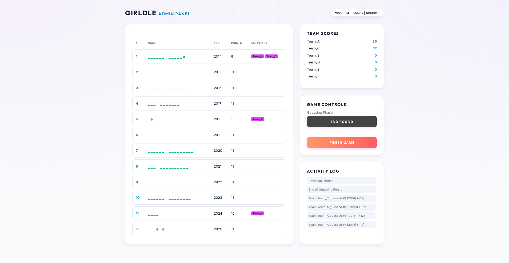
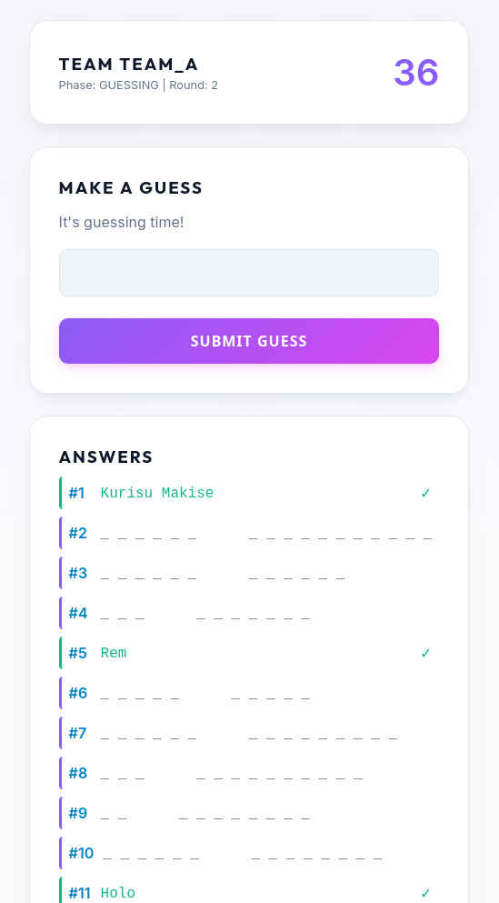
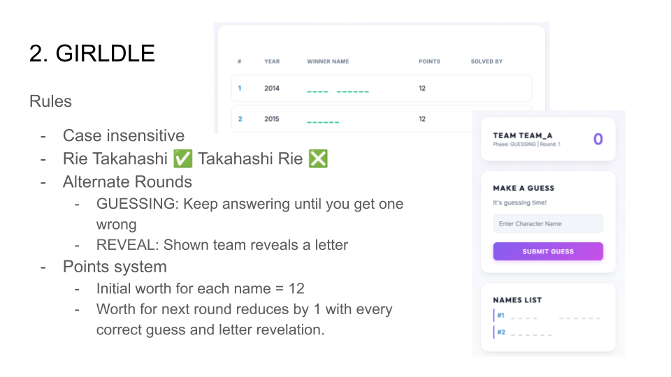
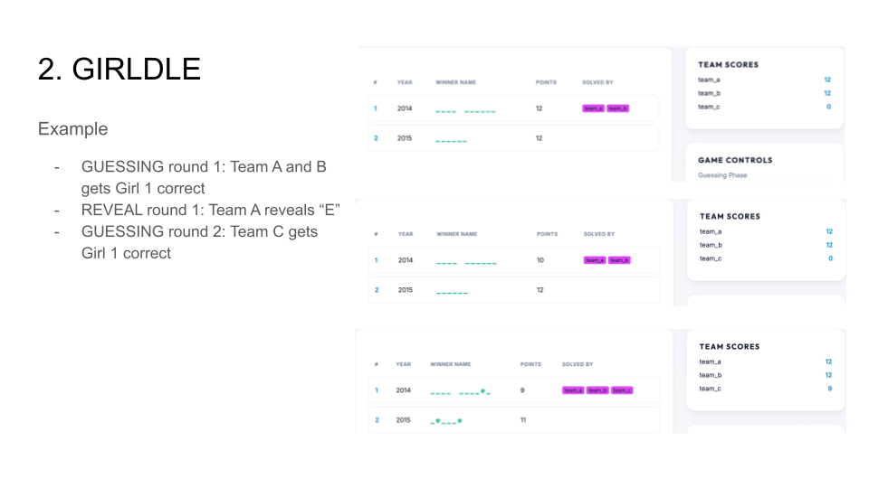
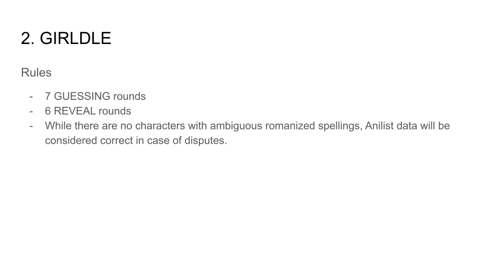

# GIRLDLE

A part of "My Little quiz can't be this cute: A degen anime quiz" @ Anime India Kolkata 2026.

Admin UI(visible to public, controlled by admin):

Player UI(visible to players, mobile friendly):

The game state is always written to disk in `db.json`, so you can recover across server crashes.
The application has been tested for 6 concurrent players, but it should support more.

### Game Rules

### How to run

- Setup a venv with requirements.txt
- Fill in `contest_data.csv`, `config.json` and `teams.json`.
- Delete `db.json` to reset any previous game state.
- Run `python server.py`
  - Set the `HOST` and `PORT` env vars if required

Use gunicorn or something similar for production.
